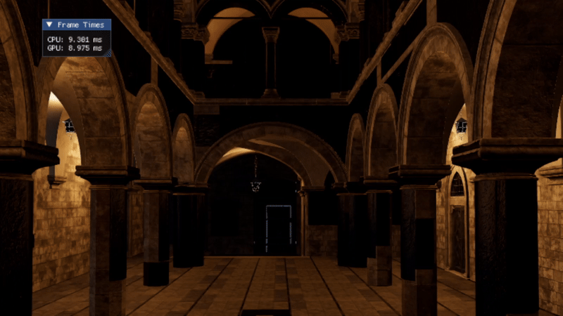

gltf file Renderer through DX12 API
=============

## Requirment
#### you need GPU which support DX12

## User environment
#### visual studio 2022 version 17.14.8
#### Windows 11 SDK(10.0.22621.0)
#### c++20 standard
#### cpu : 12th Gen Intel(R) Core(TM) i5-12400F
#### gpu : NVIDIA GeForce RTX 3060 Ti

# Set up
> imgui setup
>   > This repo use imgui interface.      
>   > You should clone repo(https://github.com/ocornut/imgui/tree/87d7f7744efe63e77f4d0e00ccb5f6affd12aca7) in folder named external.     
>   > Expected result of directory is MiniEngine/external/imgui/..     

> sponza scene
>   > This repo demo scene is sponza base scene.     
>   > Download scene .zip file in (https://www.intel.com/content/www/us/en/developer/topic-technology/graphics-research/samples.html)     
>   > Unzip them in the directory where this repo placed (if you want to place scene in other directory, see bellow "Other Scene Load").     
>   > Expected result of directory tree is like this.     
>   >   > -main_sponza    
>   >   > --(main sponza scene files...)    
>   >   > -MiniEngine     
>   >   > --(MiniEngine repo code files...)    

# Other Scene Load
> If you want to load other scene, parse your path useing --scene_path="your_scene_path" in cmd.     
> Example: MiniEngineCore.exe --scene_path="your_scene_path.gltf"     

# example result
> Caution: Scene Loading can take several minutes, depending on the hardware.

